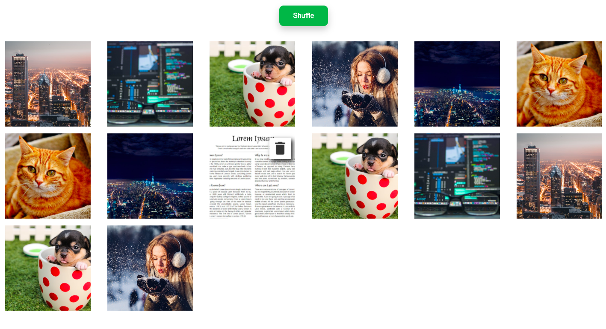

# SplashLearn_Frontend_Test
# About
> Basic HTML CSS Vanilla JS Website 

## Feature's
- progressive image loading.
- Shuffling Image.
- Responsive layout using CSS Grid and media query.
- On image hover, rotating the image.
- delete icon with onclick on which all other images should adjust themselves and current Image should get deleted.

## demo image

Format: 

	
	
